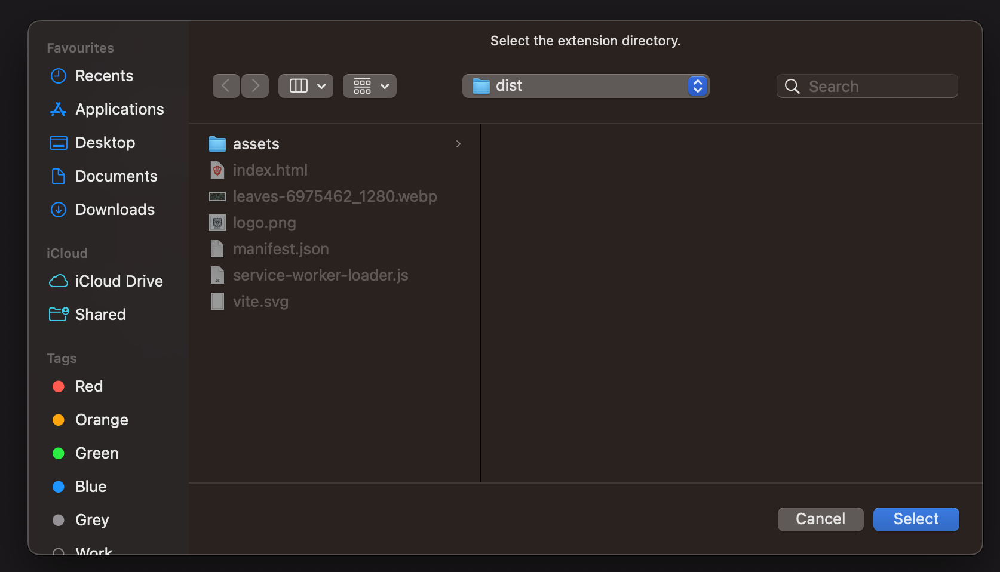
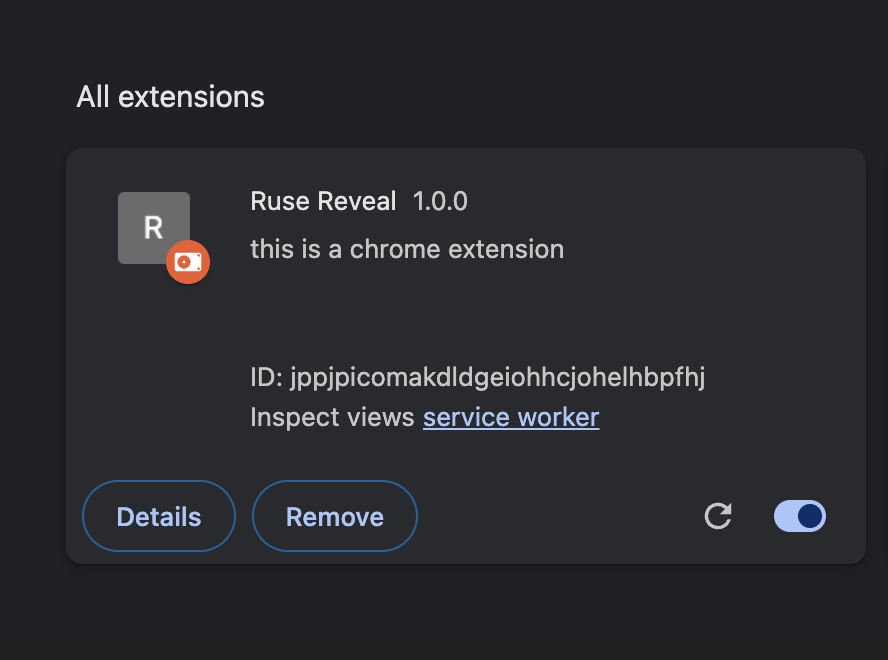
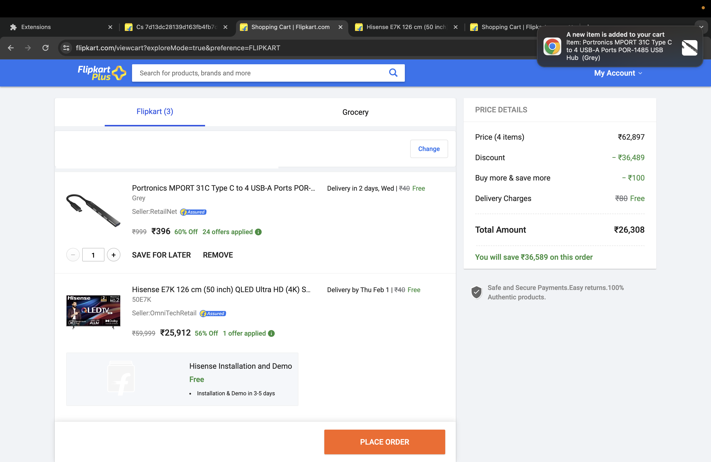
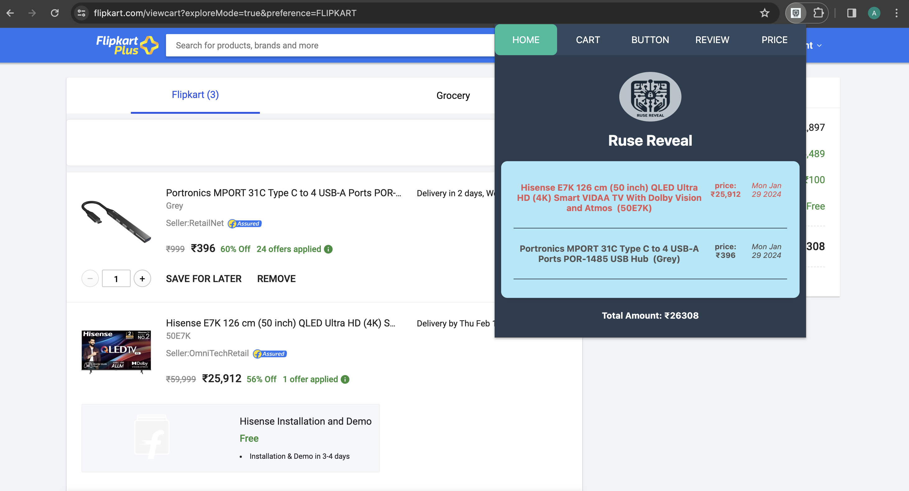
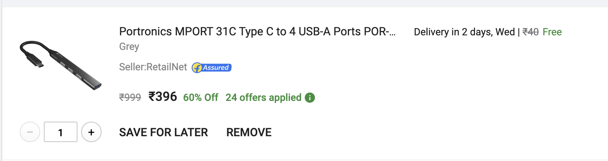
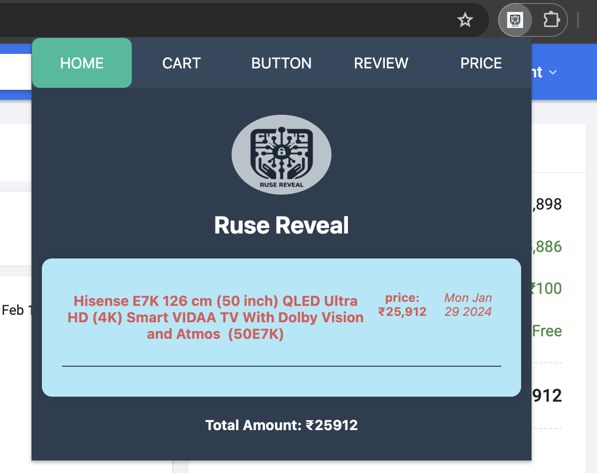
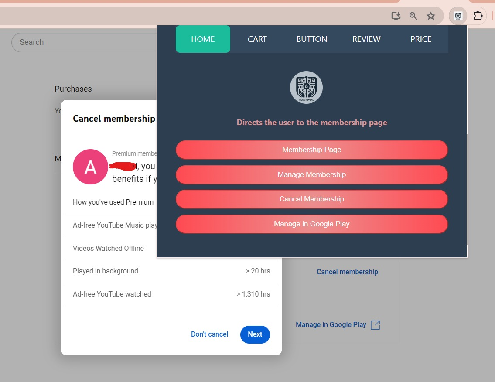

# React + Vite

This is an Extension that helps to detect Dark Patterns On a Ecommerce Website.

# Ruse-Reveal

## Installation

1. Clone the repository

```shell
git clone https://github.com/JainArchit16/Ruse-Reveal
```

2. Change your directory to Ruse-Reveal

```sh
cd Ruse-Reveal
```

3. Run the command for neccessary packages

```sh
npm install
```

4. Now build the app

```sh
npm run build
```

5. Open your browser's extension management page
6. Enable "Developer mode."
7. Click "Load unpacked" and select the "dist" folder in your extension directory.



This will load the extension on your browser



## Features

1. Sneak Into Cart
2. Button Visibility Manipulation
3. Reviews
4. Price Prediction

## Sneak Into Cart

1. Give a notification when a new item is added to cart



2. All cart items will be shown in the cart section of extension with their price, date, and the total amount of items.

3. Keep a check of all items and make it red when it is their in the cart for 7 or more days



4. When an item is removed from cart, it will also be deleted from extension UI



Item removed



## Button Visibility Manipulation

To address this issue, we have incorporated a button extension into our main model. This enables users to conveniently access membership and cancellation details on an eCommerce website through a standardized display of all buttons within the extension, facilitating seamless operation within the extension itself.


